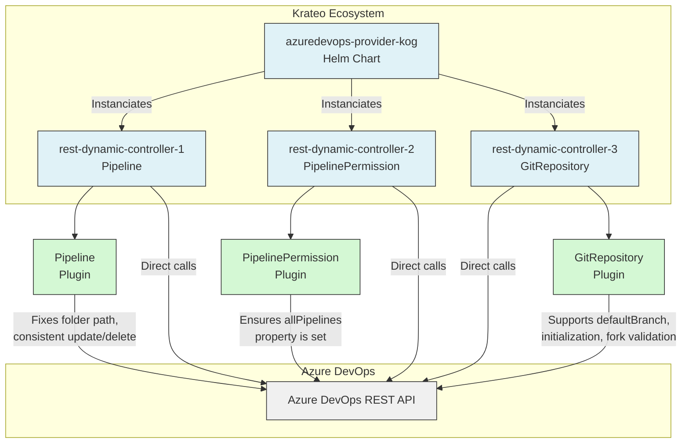

# Azure DevOps Provider KOG - Plugins

This README is only related to the plugins contained in this repository. For more information about the Azure DevOps Provider KOG (Krateo Operator Generator), please refer to the [main README](../README.md).

This repository contains the source code of a set of plugins written in Go for the Azure DevOps Provider KOG.

These plugins are specialized web services that address some inconsistencies in the Azure DevOps REST API or provide a way to use Azure DevOps API seamlessly within KOG (Krateo Operator Generator). This may be due differences in request/response schemas, missing fields, or additional validations needed when managing Azure DevOps resources. 

Sometimes, since the REST API is not originally designed to be used by a Kubernetes operator, these plugins fill the gap by providing the necessary functionality to manage Azure DevOps resources effectively through KOG.
On the other hand, some missing features of Krateo Operator Generator are addressed by these plugins as well.

In addition, some resources managed by Azure DevOps Provider KOG are **abstractions** (e.g, `RepositoryPermission`, `BuildPermission`) that do not have a direct counterpart in the Azure DevOps REST API. In these cases, the plugins implement the necessary logic to map the Kubernetes Custom Resource specifications to the appropriate Azure DevOps API calls.

They are designed to work as a middleware between the [Rest Dynamic Controller](https://github.com/krateoplatformops/rest-dynamic-controller/) and the Azure DevOps REST API.

## Summary

- [Project structure](#project-structure)
- [Architecture](#architecture)
- [GitRepository plugin](#gitrepository-plugin)
  - [POST GitRepository](#post-gitrepository)
- [Pipeline plugin](#pipeline-plugin)
  - [GET Pipeline](#get-pipeline)
  - [UPDATE Pipeline](#update-pipeline)
  - [DELETE Pipeline](#delete-pipeline)
- [PipelinePermission plugin](#pipelinepermission-plugin)
  - [GET PipelinePermission](#get-pipelinepermission)
- [PullRequest plugin](#pullrequest-plugin)
  - [PATCH PullRequest](#patch-pullrequest)
- [RepositoryPermission plugin](#repositorypermission-plugin)
  - [GET RepositoryPermission](#get-repositorypermission)
  - [POST RepositoryPermission](#post-repositorypermission)
- [BuildPermission plugin](#buildpermission-plugin)
  - [GET BuildPermission](#get-buildpermission)
  - [POST BuildPermission](#post-buildpermission)
- [Project plugin](#project-plugin)
  - [POST Project](#post-project)
  - [PATCH Project](#patch-project)
- [GraphGroup plugin](#graphgroup-plugin)
  - [GET GraphGroups](#get-graphgroups)
- [VariableGroup plugin](#variablegroup-plugin)
  - [POST VariableGroup (Get)](#post-variablegroup-get)
  - [POST VariableGroups (FindBy)](#post-variablegroups-findby)
  - [DELETE VariableGroup](#delete-variablegroup)
- [Azure DevOps API Reference](#azuredevops-api-reference)
- [Authentication](#authentication)
- [API documentation](#api-documentation)
- [Development and Testing Guide](#development-and-testing-guide)

## Project structure

The project is organized as a Go workspace-based monorepo containing multiple, independent plugins. Each plugin resides in its own subdirectory under the `cmd/` directory, while shared code is located in the `pkg/` directory.
Each plugin is a standalone Go module, allowing for independent building and versioning.
Therefore, each plugin can be built into its own container image. Please refer to the [release process section of the main readme](../README.md#release-process) for more details.

## Architecture

The diagram below illustrates how the Azure DevOps Plugin interacts within the Krateo ecosystem, including the `rest-dynamic-controller` and the `azuredevops-provider-kog` as well as the Azure DevOps REST API.
Note that this is only a **partial representation** showing only 3 managed resources as an example (`Pipeline`, `PipelinePermission`, and `GitRepository`).



## GitRepository plugin

### POST GitRepository

**Description**:
This endpoint creates a new GitRepository in the specified Azure DevOps project.
It allows you to specify the `initialize` field to indicate whether the repository should be initialized with a first commit. (Note: you cannot initialize a repository with a first commit if you are forking a repository).
It allows you to specify the `defaultBranch` field to set the default branch of the repository.

<details>
<summary><b>Why This Endpoint Exists</b></summary>
<br/>

- The standard Azure DevOps REST API has two different request body schemas for creating (`POST`) and updating (`PATCH`) Git repositories. In particular, the field `defaultBranch` is only available in the `PATCH` request body.
- This endpoint allows you to create a Git repository with the `defaultBranch` field, which is not supported in the standard Azure DevOps REST API for the `POST` request body. Practically performing a `PATCH` operation on the repository immediately after creation.
- Moreover, it allows you to initialize the repository with a first commit by setting the `initialize` field to `true`.
- In addition, it performs additional validations related to branch existence (for forks) and repository initialization.
- Another additional validation is that it checks if the `sourceRef` branch exists in the parent repository when forking a repository. If it does not exist, it returns a `400 Bad Request` error.

</details>

<details>
<summary><b>Request</b></summary>
<br/>

```http
POST /api/{organization}/{projectId}/git/repositories
```

**Path parameters**:
- `organization` (string, required): The name of the Azure DevOps organization.
- `projectId` (string, required): The ID or name of the Azure DevOps project.

**Query parameters**:
- `api-version` (string, required): The version of the Azure DevOps REST API to use. For example, `7.2-preview.2`.
- `sourceRef` (string, optional): The source reference for the repository. This is typically a branch name (e.g., `refs/heads/main`).

**Request body example**:
```json
{
  "name": "string",
  "defaultBranch": "string",    // Adjusted field
  "initialize": true,           // Adjusted field

  // From here, optional, fork-related fields:
  "parentRepository": {
    "id": "4b8c6f64-5717-4562-b3fc-2c963f66afa6",
    "project": {
      "id": "3fa85f64-5717-4562-b3fc-2c963f66afa6",
    }
  },
  "project": {
    "id": "3fa85f64-5717-4562-b3fc-2c963f66afa6",
  }
}
```

> The field `projectId` (path parameter) can be either the project ID or the project name. The fields `project.id` and `parentRepository.project.id` in the request body must be the project ID (not the project name) and are required when forking a repository. If you are not forking a repository, you have to omit these fields.

</details>

<details>
<summary><b>Response</b></summary>
<br/>

**Response status codes**:
- `201 Created`: The GitRrepository was successfully created.
- `202 Accepted`: The GitRrepository was successfully created but `defaultBranch` specified in the request body does not exist in the repository.
- `400 Bad Request`: The request body is invalid, the `sourceRef` branch does not exist in the parent repository or other validation errors occurred.
- `401 Unauthorized`: The request is not authorized. Ensure that the `Authorization` header is set correctly.
- `500 Internal Server Error`: An unexpected error occurred while processing the request.

**Response body example**:
```json
{
  "_links": {
    "links": {
      "additionalProp1": {},
      "additionalProp2": {},
      "additionalProp3": {}
    }
  },
  "creationDate": "2025-07-06T12:28:03.454Z",
  "defaultBranch": "string",
  "id": "3fa85f64-5717-4562-b3fc-2c963f66afa6",
  "isDisabled": true,
  "isFork": true,
  "isInMaintenance": true,
  "name": "string",
  "parentRepository": {
    "collection": {
      "avatarUrl": "string",
      "id": "3fa85f64-5717-4562-b3fc-2c963f66afa6",
      "name": "string",
      "url": "string"
    },
    "id": "3fa85f64-5717-4562-b3fc-2c963f66afa6",
    "isFork": true,
    "name": "string",
    "project": {
      "abbreviation": "string",
      "defaultTeamImageUrl": "string",
      "description": "string",
      "id": "3fa85f64-5717-4562-b3fc-2c963f66afa6",
      "lastUpdateTime": "2025-07-06T12:28:03.454Z",
      "name": "string",
      "revision": 0,
      "state": "deleting",
      "url": "string",
      "visibility": "private"
    },
    "remoteUrl": "string",
    "sshUrl": "string",
    "url": "string"
  },
  "project": {
    "abbreviation": "string",
    "defaultTeamImageUrl": "string",
    "description": "string",
    "id": "3fa85f64-5717-4562-b3fc-2c963f66afa6",
    "lastUpdateTime": "2025-07-06T12:28:03.454Z",
    "name": "string",
    "revision": 0,
    "state": "deleting",
    "url": "string",
    "visibility": "private"
  },
  "remoteUrl": "string",
  "size": 0,
  "sshUrl": "string",
  "url": "string",
  "validRemoteUrls": [
    "string"
  ],
  "webUrl": "string"
}
```

</details>

---

## Pipeline plugin

### GET Pipeline

**Description**:
This endpoint retrieves a specific pipeline by its ID in the specified Azure DevOps project.
It returns the pipeline details, including its ID, name, and other metadata.

<details>
<summary><b>Why This Endpoint Exists</b></summary>
<br/>

- The standard Azure DevOps REST API return the `folder` field with an "escaped backslash" as prefix like `"folder":"\\test-folder"`.
- This endpoint returns the `folder` field without the "escaped backslash" prefix, allowing a correct comparison with the `folder` field set in the `spec` of the `Pipeline` resource. Otherwise, the reconciliation loop in KOG would always detect a difference, for example, between `"\\test-folder"` (from Azure DevOps REST API) and `"test-folder"` (from `spec`), leading to infinite drift detections and useless updates.

</details>

<details>
<summary><b>Request</b></summary>
<br/>

```http
GET /api/{organization}/{project}/pipelines/{id}
```

**Path parameters**:
- `organization` (string, required): The name of the Azure DevOps organization.
- `project` (string, required): The name of the Azure DevOps project.
- `id` (string, required): The ID of the pipeline to retrieve.

**Query parameters**:
- `api-version` (string, required): The version of the Azure DevOps REST API to use. For example, `7.2-preview.1`.

</details>

<details>
<summary><b>Response</b></summary>
<br/>

**Response status codes**:
- `200 OK`: The request was successful and the pipeline details are returned.
- `400 Bad Request`: The request is invalid. Ensure that the `organization`, `project`, and `id` parameters are correct.
- `401 Unauthorized`: The request is not authorized. Ensure that the `Authorization` header is set correctly.
- `500 Internal Server Error`: An unexpected error occurred while processing the request.

**Response body example**:
```json
{
  "_links":{
    "self":{
      "href":"string"
      },
    "web":{
      "href":"string"
    }
  },
  "configuration":{
    "path":"pipelines/test_inner_pipeline.yml",
    "repository":{
      "id":"string",
      "type":"azureReposGit"
    },
    "type":"yaml"
  },
  "folder":"test-folder-kog", // Adjusted field, from "\\test-folder-kog" to "test-folder-kog"
  "id":49,
  "name":"test-pipeline-kog-1",
  "revision":1,
  "url":"string"
}
```

</details>

### UPDATE Pipeline

**Description**:
This endpoint updates an existing pipeline in the specified Azure DevOps project.
In particular, it allows you to change the pipeline's name, folder, and configuration details such as the path to the configuration file.

<details>
<summary><b>Why This Endpoint Exists</b></summary>
<br/>

- The standard Azure DevOps REST API does not have a `/pipelines/{id}` endpoint for updating pipelines.
- In order to update a pipeline, you need to use the `/build/definitions/{id}` endpoint, which is not consistent with the `/pipelines/{id}` endpoint used for retrieving pipelines.
- This endpoint provides a consistent way to update pipelines using the `/pipelines/{id}` endpoint and the same request body schema as the `POST /pipelines` endpoint of Azure DevOps REST API.
- In particular, the plugin creates a `BuildDefinitionMinimal` object starting from the request body and then performs a `PUT` request to the `/build/definitions/{id}` endpoint of Azure DevOps REST API.
- A needed adjustement related to the repository type is performed, as the Azure DevOps REST API returns different values for the `repository.type` field depending on the endpoint used to retrieve the pipeline. For instance, even if a pipeline is linked to a `azureReposGit` repository, the `/build/definitions/{id}` endpoint returns `repository.type` as `TfsGit`, while the `/pipelines/{id}` endpoint returns `repository.type` as `azureReposGit`.
- Moreover, since this endpoint under the hood uses the `/build/definitions/{id}` Azure DevOps endpoint, the plugin set the correct `api-version` parameter needed to update a pipeline using the `/build/definitions/{id}` endpoint (`7.2-preview.7`).

> Currently, the `api-version` parameter is passed as an environment variable to the plugin by the related Helm chart.

</details>

<details><summary><b>Request</b></summary>
<br/>

```http
PUT /api/{organization}/{project}/pipelines/{id}
```

**Path parameters**:
- `organization` (string, required): The name of the Azure DevOps organization.
- `project` (string, required): The name of the Azure DevOps project.
- `id` (string, required): The ID of the pipeline to update.

**Request body example**:
```json
{
  "configuration":{
    "path":"pipelines/inner_folder/another_config.yml",
    "repository":{
      "id":"string",
      "type":"azureReposGit"
    },
    "type":"yaml"
  },
  "folder":"test-folder-kog",
  "name":"test-pipeline-kog-1-v2",
  "revision":"3"
}
```

</details>

<details><summary><b>Response</b></summary>
<br/>

**Response status codes**:
- `200 OK`: The pipeline was successfully updated.
- `400 Bad Request`: The request body is invalid or the pipeline ID does not exist.
- `401 Unauthorized`: The request is not authorized. Ensure that the `Authorization` header is set correctly.
- `404 Not Found`: The specified pipeline does not exist in the project.
- `500 Internal Server Error`: An unexpected error occurred while processing the request.

**Response body example**:
```json
{
  "_links":{
    "self":{
      "href":"string"
      },
    "web":{
      "href":"string"
    }
  },
  "configuration":{
    "path":"pipelines/test_inner_pipeline.yml",
    "repository":{
      "id":"string",
      "type":"azureReposGit" // Adjusted field
    },
    "type":"yaml"
  },
  "folder":"test-folder-kog", // Adjusted field
  "id":49,
  "name":"test-pipeline-kog-1",
  "revision":1,
  "url":"string"
}
```

</details>

### DELETE Pipeline

**Description**:
This endpoint deletes a specific pipeline by its ID in the specified Azure DevOps project.

<details>
<summary><b>Why This Endpoint Exists</b></summary>
<br/>

- The standard Azure DevOps REST API does not have a `/pipelines/{id}` endpoint for deleting pipelines.
- In order to delete a pipeline, you need to use the `/build/definitions/{id}` endpoint, which currently support a different `api-version` parameter when compared to the `/pipelines/{id}` endpoint used for retrieving pipelines.
- This endpoint sets the correct `api-version` parameter needed to delete a pipeline using the `/build/definitions/{id}` endpoint (`7.2-preview.7`).

> Currently, the `api-version` parameter for BuildDefinitions is passed as an environment variable to the plugin by the related Helm chart.

</details>

<details><summary><b>Request</b></summary>
<br/>

```http
DELETE /api/{organization}/{project}/pipelines/{id}
```

**Path parameters**:
- `organization` (string, required): The name of the Azure DevOps organization.
- `project` (string, required): The name of the Azure DevOps project.
- `id` (string, required): The ID of the pipeline to delete.

</details>

<details><summary><b>Response</b></summary>
<br/>

**Response status codes**:
- `204 No Content`: The pipeline was successfully deleted.
- `400 Bad Request`: The request is invalid or the pipeline ID does not exist.
- `401 Unauthorized`: The request is not authorized. Ensure that the `Authorization` header is set correctly.
- `404 Not Found`: The specified pipeline does not exist in the project.
- `500 Internal Server Error`: An unexpected error occurred while processing the request.

</details>

---

## PipelinePermission plugin

### GET PipelinePermission

**Description**: 
Given a `ResourceType` and `ResourceId`, it returns authorized definitions for that resource.
More precisely, it returns the list of `pipelines` that have permissions to access the specified resource and the fact whether `allPipelines` have access to it.

<details>
<summary><b>Why This Endpoint Exists</b></summary>
<br/>

- The standard Azure DevOps REST API **does not return** the `allPipelines` property when said property is set to `authorized: false` on Azure DevOps (default behavior).
- This endpoint checks if the response from the Azure DevOps REST API contains the `allPipelines` property and, if not, it adds it with a value of `authorized: false`. This is necessary to have a correct reconciliation loop in KOG, as the absence of the `allPipelines` property in the response would determine an incomplete comparison with the `spec` of the `PipelinePermission` resource.

</details>

<details>
<summary><b>Request</b></summary>
<br/>

```http
GET /api/{organization}/{project}/pipelines/pipelinepermissions/{resourceType}/{resourceId}
```

**Path parameters**:
- `organization` (string, required): The name of the Azure DevOps organization.
- `project` (string, required): The name of the Azure DevOps project.
- `resourceType` (string, required): The type of resource for which permissions are being requested (e.g., `repository`, `environment`, `queue`).
- `resourceId` (string, required): The ID of the resource for which permissions are being requested.

**Query parameters**:
- `api-version` (string, required): The version of the Azure DevOps REST API to use. For example, `7.2-preview.2`.
</details>

<details>
<summary><b>Response</b></summary>
<br/>

**Response status codes**:
- `200 OK`: The request was successful.
- `401 Unauthorized`: The request is not authorized. Ensure that the `Authorization` header is set correctly.
- `500 Internal Server Error`: An unexpected error occurred while processing the request.

**Response body example**:
```json
{
  "resource": {
    "type":"environment",
    "id":"7"
  },
  "allPipelines":{
    "authorized":false // Adjusted field, added if missing in the response from Azure DevOps REST API
  },
  "pipelines": [
    {
      "id":14,
      "authorized":true,
      "authorizedBy": {
        "displayName":"<REDACTED>",
        "id":"<REDACTED>",
        "uniqueName":"<REDACTED>",
        "descriptor":"<REDACTED>"
      },
      "authorizedOn":"2025-06-30T14:33:02.06Z"
    },
    {
      "id":15,
      "authorized":true,
      "authorizedBy": {
        "displayName":"<REDACTED>",
        "id":"<REDACTED>",
        "uniqueName":"<REDACTED>",
        "descriptor":"<REDACTED>"
      },
      "authorizedOn":"2025-06-30T14:33:02.06Z"
    }
  ]
}
```
</details>

---

## PullRequest plugin

### PATCH PullRequest

**Description**:
This endpoint updates an existing pull request in the specified Azure DevOps project.

<details>
<summary><b>Why This Endpoint Exists</b></summary>
<br/>

- The endpoint calculates only the modified fields between the current state of the pull request in Azure DevOps and the desired state specified in the request body (coming from the Kubernetes CR), and it sends only those modified fields in the `PATCH` request to the Azure DevOps REST API. Indeed, Azure DevOps throws an error if you try to set a field to its current value, for instance in the case of `TargetRefName` field.
- In addition, it manages `LastMergeSourceCommit` field which is required only when updating status to "completed": if not set, Azure DevOps returns an error. If set in other cases, Azure DevOps returns an error.
- It also performs additional validations related to pull request state transitions: an already completed pull request cannot be updated.

</details>

<details>
<summary><b>Request</b></summary>
<br/>

```http
PATCH /api/{organization}/{project}/git/repositories/{repositoryId}/pullrequests/{pullRequestId}
```

**Path parameters**:
- `organization` (string, required):T he name of the Azure DevOps organization.
- `project` (string, required): Project ID or project name.
- `repositoryId` (string, required):  The repository ID of the pull request's target branch.
- `pullRequestId` (string, required): The ID of the pull request to update

**Query parameters**:
- `api-version` (string, required): The version of the Azure DevOps REST API to use. For example, `7.2-preview.2`.

**Request body example**:
```json
{
  "completionOptions": {
    "deleteSourceBranch": false,
    "mergeCommitMessage": "Squash merge for feature X, test from Krateo",
    "mergeStrategy": "squash",
    "transitionWorkItems": true
  },
  "description": "Test PR description from Krateo",
  "lastMergeSourceCommit": {
    "commitId": "<REDACTED>",
    "url": "<REDACTED>"
  },
  "mergeOptions": {
    "conflictAuthorshipCommits": true,
    "detectRenameFalsePositives": false,
    "disableRenames": false
  },
  "status": "active",
  "targetRefName": "refs/heads/main",
  "title": "Test PR from Krateo test-branch"
}
```

</details>

<details>
<summary><b>Response</b></summary>
<br/>

**Response status codes**:
- `200 OK`: The pull request was successfully updated.
- `400 Bad Request`: The request body is invalid or the pull request ID does not exist.
- `401 Unauthorized`: The request is not authorized. Ensure that the `Authorization` header is set correctly.
- `404 Not Found`: The specified pull request does not exist in the repository.
- `409 Conflict`: The pull request cannot be updated due to a conflict (e.g., trying to update a completed pull request).
- `500 Internal Server Error`: An unexpected error occurred while processing the request.

**Response body example**:
```json
{
  "repository": {
    "id": "5605b0ba-e2fa-4aab-af0b-0888321b3a08",
    "name": "repo-1-classic",
    "url": "<REDACTED>",
    "project": {
      "id": "99837031-4e4e-4753-9a47-73fcc4cba766",
      "name": "project-1-classic",
      "description": "test",
      "url": "<REDACTED>",
      "state": "wellFormed",
      "revision": 626,
      "visibility": "private",
      "lastUpdateTime": "2025-12-03T08:38:51.013Z"
    },
    "size": 10828,
    "remoteUrl": "<REDACTED>",
    "sshUrl": "<REDACTED>",
    "webUrl": "<REDACTED>",
    "isDisabled": false,
    "isInMaintenance": false
  },
  "pullRequestId": 402,
  "codeReviewId": 402,
  "status": "active",
  "createdBy": {
    "displayName": "Leonardo Vicentini",
    "url": "<REDACTED>",
    "_links": {
      "avatar": {
        "href": "<REDACTED>"
      }
    },
    "id": "<REDACTED>",
    "uniqueName": "leonardo.vicentini@krateo.io",
    "imageUrl": "<REDACTED>",
    "descriptor": "<REDACTED>"
  },
  "creationDate": "2025-12-03T14:44:56.2184364Z",
  "title": "Test PR from Krateo test-branch",
  "description": "Test PR description from Krateo",
  "sourceRefName": "refs/heads/test-3-12-25",
  "targetRefName": "refs/heads/main",
  "mergeStatus": "succeeded",
  "isDraft": false,
  "mergeId": "<REDACTED>",
  "lastMergeSourceCommit": {
    "commitId": "<REDACTED>",
    "url": "<REDACTED>"
  },
  "lastMergeTargetCommit": {
    "commitId": "<REDACTED>",
    "url": "<REDACTED>"
  },
  "lastMergeCommit": {
    "commitId": "<REDACTED>",
    "author": {
      "name": "Leonardo Vicentini",
      "email": "leonardo.vicentini@krateo.io",
      "date": "2025-11-17T15:08:26Z"
    },
    "committer": {
      "name": "Leonardo Vicentini",
      "email": "leonardo.vicentini@krateo.io",
      "date": "2025-11-17T15:08:26Z"
    },
    "comment": "Squash merge for feature X, test from Krateo",
    "url": "<REDACTED>"
  },
  "reviewers": [],
  "url": "<REDACTED>",
  "_links": {
    "self": {
      "href": "<REDACTED>"
    },
    "repository": {
      "href": "<REDACTED>"
    },
    "workItems": {
      "href": "<REDACTED>"
    },
    "sourceBranch": {
      "href": "<REDACTED>"
    },
    "targetBranch": {
      "href": "<REDACTED>"
    },
    "statuses": {
      "href": "<REDACTED>"
    },
    "sourceCommit": {
      "href": "<REDACTED>"
    },
    "targetCommit": {
      "href": "<REDACTED>"
    },
    "createdBy": {
      "href": "<REDACTED>"
    },
    "iterations": {
      "href": "<REDACTED>"
    }
  },
  "completionOptions": {
    "mergeCommitMessage": "Squash merge for feature X, test from Krateo",
    "squashMerge": true,
    "mergeStrategy": "squash",
    "transitionWorkItems": true
  },
  "mergeOptions": {
    "disableRenames": false,
    "detectRenameFalsePositives": false,
    "conflictAuthorshipCommits": true
  },
  "supportsIterations": true,
  "artifactId": "<REDACTED>"
}
```

</details>

---

## RepositoryPermission plugin

### GET RepositoryPermission

**Description**:
This endpoint get the permissions of a repository.

<details>
<summary><b>Why This Endpoint Exists</b></summary>
<br/>

- RepositoryPermission is an abstraction that does not have a direct counterpart in the Azure DevOps REST API.
- This endpoint implements the necessary logic to map the Kubernetes Custom Resource specifications to the appropriate Azure DevOps API calls.

</details>

<details>
<summary><b>Request</b></summary>
<br/>

```http
GET /plugin/repositorypermission/{organization}/{projectId}
```

**Path parameters**:
- `organization` (string, required): The name of the Azure DevOps organization.
- `projectId` (string, required): The ID of the Azure DevOps project.

**Query parameters**:
- `repositoryId` (string, optional): The ID of the repository.
- `identityType` (string, optional): Type of identity (e.g., 'azure-group', 'build-service').
- `identityName` (string, optional): Name of the identity (e.g., Contributors), not used if identityType is 'build-service' or if identityDescriptor is provided.
- `identityDescriptor` (string, optional): Descriptor of the identity, has priority over identityType and identityName.
- `projectLevel` (boolean, optional): Whether to manage permissions at the project level (true) or repository level (false). Default is false.
- `api-version` (string, required): The version of the Azure DevOps REST API to use. For example, `7.2-preview.1`.

</details>

<details>
<summary><b>Response</b></summary>
<br/>

**Response status codes**:
- `200 OK`: The request was successful.
- `400 Bad Request`: The request is invalid. Ensure that the parameters are correct.
- `401 Unauthorized`: The request is not authorized. Ensure that the `Authorization` header is set correctly.
- `404 Not Found`: The specified repository or identity does not exist.
- `500 Internal Server Error`: An unexpected error occurred while processing the request.


**Response body example**:
```json
{
  "organization": "krateo-kog",
  "projectId": "99837031-4e4e-4753-9a47-73fcc4cba766",
  "repositoryId": "c2f8d804-7c2f-4f3f-bd69-70c3169cfb8c",
  "projectLevel": false,
  "permissions": {
    "identity": {
      "type": "azure-group",
      "name": "Contributors",
      "descriptor": "Microsoft.TeamFoundation.Identity;<REDACTED>"
    },
    "allow": {
      "Administer": false,
      "CreateBranch": true,
      "CreateRepository": false,
      "CreateTag": false,
      "DeleteRepository": false,
      "DismissAdvSecAlerts": false,
      "EditPolicies": false,
      "ForcePush": false,
      "GenericContribute": false,
      "GenericRead": false,
      "ManageAdvSecScanning": false,
      "ManageNote": false,
      "ManagePermissions": false,
      "PolicyExempt": false,
      "PullRequestBypassPolicy": false,
      "PullRequestContribute": false,
      "RemoveOthersLocks": false,
      "RenameRepository": true,
      "ViewAdvSecAlerts": false
    },
    "deny": {
      "Administer": false,
      "CreateBranch": false,
      "CreateRepository": false,
      "CreateTag": true,
      "DeleteRepository": false,
      "DismissAdvSecAlerts": false,
      "EditPolicies": true,
      "ForcePush": true,
      "GenericContribute": false,
      "GenericRead": false,
      "ManageAdvSecScanning": false,
      "ManageNote": false,
      "ManagePermissions": false,
      "PolicyExempt": false,
      "PullRequestBypassPolicy": false,
      "PullRequestContribute": false,
      "RemoveOthersLocks": false,
      "RenameRepository": false,
      "ViewAdvSecAlerts": true
    }
  }
}
```

</details>

### POST RepositoryPermission

**Description**:
This endpoint updates the permissions of a repository.

<details>
<summary><b>Why This Endpoint Exists</b></summary>
<br/>

- RepositoryPermission is an abstraction that does not have a direct counterpart in the Azure DevOps REST API.
- This endpoint implements the necessary logic to map the Kubernetes Custom Resource specifications to the appropriate Azure DevOps API calls.

</details>

<details><summary><b>Request</b></summary>
<br/>

```http
POST /plugin/repositorypermission/{organization}/{projectId}
```

**Path parameters**:
- `organization` (string, required): The name of the Azure DevOps organization.
- `projectId` (string, required): The ID of the Azure DevOps project.

**Query parameters**:
- `repositoryId` (string, optional): The ID of the repository.
- `projectLevel` (boolean, optional): Whether to manage permissions at the project level (true) or repository level (false). Default is false.
- `api-version` (string, required): The version of the Azure DevOps REST API to use. For example, `7.2-preview.1`.

**Request body example**:
```json
{
  "permissions": {
    "allow": {
      "Administer": false,
      "CreateBranch": true,
      "CreateRepository": false,
      "CreateTag": false,
      "DeleteRepository": false,
      "DismissAdvSecAlerts": false,
      "EditPolicies": false,
      "ForcePush": false,
      "GenericContribute": false,
      "GenericRead": false,
      "ManageAdvSecScanning": false,
      "ManageNote": false,
      "ManagePermissions": false,
      "PolicyExempt": false,
      "PullRequestBypassPolicy": false,
      "PullRequestContribute": false,
      "RemoveOthersLocks": false,
      "RenameRepository": false,
      "ViewAdvSecAlerts": false
    },
    "deny": {
      "Administer": false,
      "CreateBranch": false,
      "CreateRepository": false,
      "CreateTag": true,
      "DeleteRepository": false,
      "DismissAdvSecAlerts": false,
      "EditPolicies": true,
      "ForcePush": true,
      "GenericContribute": false,
      "GenericRead": false,
      "ManageAdvSecScanning": false,
      "ManageNote": false,
      "ManagePermissions": false,
      "PolicyExempt": false,
      "PullRequestBypassPolicy": false,
      "PullRequestContribute": false,
      "RemoveOthersLocks": false,
      "RenameRepository": false,
      "ViewAdvSecAlerts": true
    },
    "identity": {
      "name": "Contributors",
      "type": "azure-group"
    }
  }
}
```

</details>

<details><summary><b>Response</b></summary>
<br/>

**Response status codes**:
- `200 OK`: The request was successful.
- `400 Bad Request`: The request body is invalid. Ensure that the parameters are correct.
- `401 Unauthorized`: The request is not authorized. Ensure that the `Authorization` header is set correctly.
- `404 Not Found`: The specified repository or identity does not exist. 
- `500 Internal Server Error`: An unexpected error occurred while processing the request.

**Response body example**:
```json
{
  "organization": "krateo-kog",
  "projectId": "99837031-4e4e-4753-9a47-73fcc4cba766",
  "repositoryId": "c2f8d804-7c2f-4f3f-bd69-70c3169cfb8c",
  "projectLevel": false,
  "permissions": {
    "identity": {
      "type": "azure-group",
      "name": "Contributors",
      "descriptor": "Microsoft.TeamFoundation.Identity;<REDACTED>"
    },
    "allow": {
      "Administer": false,
      "CreateBranch": true,
      "CreateRepository": false,
      "CreateTag": false,
      "DeleteRepository": false,
      "DismissAdvSecAlerts": false,
      "EditPolicies": false,
      "ForcePush": false,
      "GenericContribute": false,
      "GenericRead": false,
      "ManageAdvSecScanning": false,
      "ManageNote": false,
      "ManagePermissions": false,
      "PolicyExempt": false,
      "PullRequestBypassPolicy": false,
      "PullRequestContribute": false,
      "RemoveOthersLocks": false,
      "RenameRepository": false,
      "ViewAdvSecAlerts": false
    },
    "deny": {
      "Administer": false,
      "CreateBranch": false,
      "CreateRepository": false,
      "CreateTag": true,
      "DeleteRepository": false,
      "DismissAdvSecAlerts": false,
      "EditPolicies": true,
      "ForcePush": true,
      "GenericContribute": false,
      "GenericRead": false,
      "ManageAdvSecScanning": false,
      "ManageNote": false,
      "ManagePermissions": false,
      "PolicyExempt": false,
      "PullRequestBypassPolicy": false,
      "PullRequestContribute": false,
      "RemoveOthersLocks": false,
      "RenameRepository": false,
      "ViewAdvSecAlerts": true
    }
  }
}
```

</details>

---

## BuildPermission plugin

### GET BuildPermission

**Description**:
This endpoint get the permissions of a build (pipeline).

<details>
<summary><b>Why This Endpoint Exists</b></summary>
<br/>

- BuildPermission is an abstraction that does not have a direct counterpart in the Azure DevOps REST API.
- This endpoint implements the necessary logic to map the Kubernetes Custom Resource specifications to the appropriate Azure DevOps API calls.

</details>

<details>
<summary><b>Request</b></summary>
<br/>

```http
GET /plugin/buildpermission/{organization}/{projectId}
```

**Path parameters**:
- `organization` (string, required): The name of the Azure DevOps organization.
- `projectId` (string, required): The ID of the Azure DevOps project.

**Query parameters**:
- `buildDefinitionId` (string, optional): The ID of the build (pipeline).
- `identityType` (string, optional): Type of identity (e.g., 'azure-group', 'build-service').
- `identityName` (string, optional): Name of the identity (e.g., Contributors), not used if identityType is 'build-service' or if identityDescriptor is provided.
- `identityDescriptor` (string, optional): Descriptor of the identity, has priority over identityType and identityName.
- `projectLevel` (boolean, optional): Whether to manage permissions at the project level (true) or repository level (false). Default is false.
- `api-version` (string, required): The version of the Azure DevOps REST API to use. For example, `7.2-preview.1`.

</details>

<details>
<summary><b>Response</b></summary>
<br/>

**Response status codes**:
- `200 OK`: The request was successful.
- `400 Bad Request`: The request is invalid. Ensure that the parameters are correct.
- `401 Unauthorized`: The request is not authorized. Ensure that the `Authorization` header is set correctly.
- `404 Not Found`: The specified repository or identity does not exist.
- `500 Internal Server Error`: An unexpected error occurred while processing the request.

**Response body example**:
```json
{
  "organization": "krateo-kog",
  "projectId": "99837031-4e4e-4753-9a47-73fcc4cba766",
  "buildDefinitionId": "82",
  "projectLevel": false,
  "permissions": {
    "identity": {
      "type": "azure-group",
      "name": "Contributors",
      "descriptor": "Microsoft.TeamFoundation.Identity;<REDACTED>"
    },
    "allow": {
      "AbandonBuilds": false,
      "AdministerBuildPermissions": false,
      "CreateBuildDefinition": true,
      "DeleteBuildDefinition": false,
      "DeleteBuilds": false,
      "DestroyBuilds": false,
      "EditBuildDefinition": false,
      "EditBuildQuality": false,
      "EditPipelineQueueConfigurationPermission": false,
      "ManageBuildQualities": false,
      "ManageBuildQueue": false,
      "ManageStageRunOrderPermission": false,
      "OverrideBuildCheckInValidation": false,
      "QueueBuilds": false,
      "RetainIndefinitely": false,
      "StopBuilds": false,
      "UpdateBuildInformation": false,
      "ViewBuildDefinition": false,
      "ViewBuilds": false
    },
    "deny": {
      "AbandonBuilds": false,
      "AdministerBuildPermissions": false,
      "CreateBuildDefinition": false,
      "DeleteBuildDefinition": false,
      "DeleteBuilds": false,
      "DestroyBuilds": false,
      "EditBuildDefinition": false,
      "EditBuildQuality": false,
      "EditPipelineQueueConfigurationPermission": true,
      "ManageBuildQualities": false,
      "ManageBuildQueue": false,
      "ManageStageRunOrderPermission": false,
      "OverrideBuildCheckInValidation": false,
      "QueueBuilds": false,
      "RetainIndefinitely": false,
      "StopBuilds": false,
      "UpdateBuildInformation": false,
      "ViewBuildDefinition": false,
      "ViewBuilds": false
    }
  }
}
```

</details>

### POST BuildPermission

**Description**:
This endpoint updates the permissions of a build (pipeline).

<details>
<summary><b>Why This Endpoint Exists</b></summary>
<br/>

- BuildPermission is an abstraction that does not have a direct counterpart in the Azure DevOps REST API.
- This endpoint implements the necessary logic to map the Kubernetes Custom Resource specifications to the appropriate Azure DevOps API calls.

</details>

<details><summary><b>Request</b></summary>
<br/>

```http
POST /plugin/buildpermission/{organization}/{projectId}
```

**Path parameters**:
- `organization` (string, required): The name of the Azure DevOps organization.
- `projectId` (string, required): The ID of the Azure DevOps project.

**Query parameters**:
- `buildDefinitionId` (string, optional): The ID of the build (pipeline).
- `projectLevel` (boolean, optional): Whether to manage permissions at the project level (true) or repository level (false). Default is false.
- `api-version` (string, required): The version of the Azure DevOps REST API to use. For example, `7.2-preview.1`.

**Request body example**:
```json
{
  "permissions": {
    "allow": {
      "AbandonBuilds": false,
      "AdministerBuildPermissions": false,
      "CreateBuildDefinition": true,
      "DeleteBuildDefinition": false,
      "DeleteBuilds": false,
      "DestroyBuilds": false,
      "EditBuildDefinition": false,
      "EditBuildQuality": false,
      "EditPipelineQueueConfigurationPermission": false,
      "ManageBuildQualities": false,
      "ManageBuildQueue": false,
      "ManageStageRunOrderPermission": false,
      "OverrideBuildCheckInValidation": false,
      "QueueBuilds": false,
      "RetainIndefinitely": false,
      "StopBuilds": false,
      "UpdateBuildInformation": false,
      "ViewBuildDefinition": false,
      "ViewBuilds": false
    },
    "deny": {
      "AbandonBuilds": false,
      "AdministerBuildPermissions": false,
      "CreateBuildDefinition": false,
      "DeleteBuildDefinition": false,
      "DeleteBuilds": false,
      "DestroyBuilds": false,
      "EditBuildDefinition": false,
      "EditBuildQuality": false,
      "EditPipelineQueueConfigurationPermission": true,
      "ManageBuildQualities": false,
      "ManageBuildQueue": false,
      "ManageStageRunOrderPermission": false,
      "OverrideBuildCheckInValidation": false,
      "QueueBuilds": false,
      "RetainIndefinitely": false,
      "StopBuilds": false,
      "UpdateBuildInformation": false,
      "ViewBuildDefinition": false,
      "ViewBuilds": true
    },
    "identity": {
      "name": "Contributors",
      "type": "azure-group"
    }
  }
}
```

</details>

<details><summary><b>Response</b></summary>
<br/>

**Response status codes**:
- `200 OK`: The request was successful.
- `400 Bad Request`: The request body is invalid. Ensure that the parameters are correct.
- `401 Unauthorized`: The request is not authorized. Ensure that the `Authorization` header is set correctly.
- `404 Not Found`: The specified repository or identity does not exist. 
- `500 Internal Server Error`: An unexpected error occurred while processing the request.

**Response body example**:
```json
{
  "organization": "krateo-kog",
  "projectId": "99837031-4e4e-4753-9a47-73fcc4cba766",
  "buildDefinitionId": "82",
  "projectLevel": false,
  "permissions": {
    "identity": {
      "type": "azure-group",
      "name": "Contributors",
      "descriptor": "Microsoft.TeamFoundation.Identity;<REDACTED>"
    },
    "allow": {
      "AbandonBuilds": false,
      "AdministerBuildPermissions": false,
      "CreateBuildDefinition": true,
      "DeleteBuildDefinition": false,
      "DeleteBuilds": false,
      "DestroyBuilds": false,
      "EditBuildDefinition": false,
      "EditBuildQuality": false,
      "EditPipelineQueueConfigurationPermission": false,
      "ManageBuildQualities": false,
      "ManageBuildQueue": false,
      "ManageStageRunOrderPermission": false,
      "OverrideBuildCheckInValidation": false,
      "QueueBuilds": false,
      "RetainIndefinitely": false,
      "StopBuilds": false,
      "UpdateBuildInformation": false,
      "ViewBuildDefinition": false,
      "ViewBuilds": false
    },
    "deny": {
      "AbandonBuilds": false,
      "AdministerBuildPermissions": false,
      "CreateBuildDefinition": false,
      "DeleteBuildDefinition": false,
      "DeleteBuilds": false,
      "DestroyBuilds": false,
      "EditBuildDefinition": false,
      "EditBuildQuality": false,
      "EditPipelineQueueConfigurationPermission": true,
      "ManageBuildQualities": false,
      "ManageBuildQueue": false,
      "ManageStageRunOrderPermission": false,
      "OverrideBuildCheckInValidation": false,
      "QueueBuilds": false,
      "RetainIndefinitely": false,
      "StopBuilds": false,
      "UpdateBuildInformation": false,
      "ViewBuildDefinition": false,
      "ViewBuilds": true
    }
  }
}
```

</details>

---

## Project plugin

### POST Project

**Description**:
This endpoint creates a new project in Azure DevOps. It transforms the Azure DevOps API response to disambiguate operation metadata from project data, preventing reconciliation issues with OASGen Provider.

<details>
<summary><b>Why This Endpoint Exists</b></summary>
<br/>

- The standard Azure DevOps REST API returns an `OperationReference` object when creating a project (POST), containing fields like `id`, `status`, and `url`.
- The `id` field in the `OperationReference` is the **operation ID**, not the project ID.
- If OASGen Provider stores this operation ID in `status.id`, subsequent GET operations will fail because they expect the project ID.
- This plugin transforms the response by renaming all operation fields:
  - `id` → `operationId`
  - `status` → `operationStatus`
  - `url` → `operationUrl`
- This ensures the controller doesn't confuse operation metadata with project data, and reconciliation continues correctly once the project is created.
- The controller will simply ignore these fields and subsequent GET requests will retrieve the actual project once it's ready.

</details>

<details>
<summary><b>Request</b></summary>
<br/>

```http
POST /plugin/project/{organization}
```

**Path parameters**:
- `organization` (string, required): The name of the Azure DevOps organization.

**Query parameters**:
- `api-version` (string, required): The version of the Azure DevOps REST API to use. For example, `7.2-preview.4`.

**Request body example**:
```json
{
  "name": "my-new-project",
  "description": "Project created via OASGen",
  "visibility": "private",
  "capabilities": {
    "versioncontrol": {
      "sourceControlType": "Git"
    },
    "processTemplate": {
      "templateTypeId": "6b724908-ef14-45cf-84f8-768b5384da45"
    }
  }
}
```

</details>

<details>
<summary><b>Response</b></summary>
<br/>

**Response status codes**:
- `202 Accepted`: The project creation operation was queued successfully, and the transformed operation reference is returned.
- `400 Bad Request`: The request is invalid (missing parameters or malformed body).
- `401 Unauthorized`: The request is not authorized. Ensure that the `Authorization` header is set correctly.
- `500 Internal Server Error`: An unexpected error occurred while processing the request.

**Response body example**:
```json
{
  "operationId": "f0827d89-57c2-4e59-9693-7c309b42ebbb",
  "operationStatus": "notSet",
  "operationUrl": "https://dev.azure.com/krateo-kog/_apis/operations/f0827d89-57c2-4e59-9693-7c309b42ebbb",
  "operationPluginId": "12345678-1234-1234-1234-123456789abc"
}
```

> Note: All fields are prefixed with `operation` to distinguish them from actual project fields. The project will be created asynchronously, and subsequent GET operations will retrieve the actual project once it's ready. This will prevent reconciliation issues with OASGen Provider.

</details>

---

### PATCH Project

**Description**:
This endpoint updates an existing project in Azure DevOps. The operation is asynchronous, so this endpoint polls the update operation until it completes successfully, then fetches and returns the updated project.

<details>
<summary><b>Why This Endpoint Exists</b></summary>
<br/>

- The standard Azure DevOps REST API returns an `OperationReference` object when updating a project (PATCH), making the operation asynchronous.
- This endpoint provides a **synchronous** update experience by automatically polling the operation status until the update is complete.
- After the operation completes, it fetches the updated project via GET and returns the full project object.
- This simplifies Kubernetes resource management by ensuring the project is fully updated and the latest state is returned in a single request.
- The endpoint handles the complete lifecycle: initiates update, polls operation status, fetches updated project, and returns it.

</details>

<details>
<summary><b>Request</b></summary>
<br/>

```http
PATCH /plugin/project/{organization}/{projectId}
```

**Path parameters**:
- `organization` (string, required): The name of the Azure DevOps organization.
- `projectId` (string, required): The ID of the project to update.

**Query parameters**:
- `api-version` (string, required): The version of the Azure DevOps REST API to use. For example, `7.2-preview.4`.

**Request body example**:
```json
{
  "abbreviation": "UPN",
  "description": "Updated description",
}
```

</details>

<details>
<summary><b>Response</b></summary>
<br/>

**Response status codes**:
- **200 OK**: The project was updated successfully. The response body contains the updated project object.
- **400 Bad Request**: Missing organization or project ID in the request path, or invalid request body.
- **401 Unauthorized**: Missing or invalid Authorization header.
- **404 Not Found**: Project not found.
- **500 Internal Server Error**: Failed to update project, poll operation status, or fetch updated project.

**Response body example**:
```json
{
  "id": "12345678-1234-1234-1234-123456789abc",
  "name": "updated-project-name",
  "description": "Updated description",
  "abbreviation": "UPN",
  "url": "https://dev.azure.com/krateo-kog/_apis/projects/12345678-1234-1234-1234-123456789abc",
  "state": "wellFormed",
  "revision": 42,
  "visibility": "private",
  "lastUpdateTime": "2025-12-23T10:30:00.000Z",
  "_links": {
    "self": {
      "href": "https://dev.azure.com/krateo-kog/_apis/projects/12345678-1234-1234-1234-123456789abc"
    },
    "collection": {
      "href": "https://dev.azure.com/krateo-kog/_apis"
    },
    "web": {
      "href": "https://dev.azure.com/krateo-kog/updated-project-name"
    }
  },
  "defaultTeam": {
    "id": "87654321-4321-4321-4321-210987654321",
    "name": "updated-project-name Team",
    "url": "https://dev.azure.com/krateo-kog/_apis/projects/12345678-1234-1234-1234-123456789abc/teams/87654321-4321-4321-4321-210987654321"
  }
}
```

> Note: Unlike the POST operation which returns an `OperationReference`, the PATCH operation is synchronous and returns the actual updated project object once the operation completes.

</details>

### DELETE Project

**Description**:
This endpoint deletes an Azure DevOps project by its ID. The operation is asynchronous, so this endpoint polls the delete operation until it completes successfully.

<details>
<summary><b>Why This Endpoint Exists</b></summary>
<br/>

- The standard Azure DevOps Projects API DELETE operation returns an `OperationReference` with status `queued`, making the operation asynchronous.
- This endpoint provides a **synchronous** delete experience by automatically polling the operation status until the deletion is complete.
- This simplifies Kubernetes resource management by ensuring the project is fully deleted before the response is returned.
- The endpoint handles the complete lifecycle: initiates deletion, polls operation status, and confirms completion.

</details>

<details>
<summary><b>Request</b></summary>
<br/>

```http
DELETE /plugin/project/{organization}/{projectId}
```

**Path parameters**:
- `organization` (string, required): The name of the Azure DevOps organization.
- `projectId` (string, required): The ID of the project to delete.

**Query parameters**:
- `api-version` (string, required): The version of the Azure DevOps REST API to use. For example, `7.2-preview.4`.

</details>

<details>
<summary><b>Response</b></summary>
<br/>

**Response status codes**:
- **204 No Content**: The project was deleted successfully. The endpoint polls the deletion operation until it reaches a final state (`succeeded`, `failed`, or `cancelled`). Once the operation completes successfully, it returns 204 No Content.
- **400 Bad Request**: Missing organization or project ID in the request path.
- **401 Unauthorized**: Missing or invalid Authorization header.
- **404 Not Found**: Project not found or already deleted.
- **500 Internal Server Error**: Failed to delete project or poll operation status.

</details>

---

## GraphGroup plugin

### GET GraphGroups

**Description**:
This endpoint retrieves graph groups (list) from Azure DevOps, with additional filtering capabilities. When listing groups at the organization level (without a `scopeDescriptor`), it automatically filters out project-level groups to return only organization-level groups. When a `scopeDescriptor` is provided, all groups within that scope are returned without filtering.

<details>
<summary><b>Why This Endpoint Exists</b></summary>
<br/>

- The standard Azure DevOps Graph API returns both organization-level and project-level groups when listing groups without a `scopeDescriptor`, thus making it ambigous for Rest Dynamic Controller to manage groups with the same name but different scopes.
- This endpoint automatically filters out project-level groups (those with domain starting with `vstfs:///Classification/TeamProject/`) when no `scopeDescriptor` is provided (i.e., when listing at the organization level).
- When a `scopeDescriptor` is set (indicating a specific scope, such as a project), the endpoint passes through all groups without filtering, maintaining native Azure DevOps behavior.
- The response includes additional metadata fields (`originalCount`, `count`, `numberOfFilteredOut`) to provide transparency about the filtering operation.
- The pagination mechanism is preserved using the `continuationToken` query parameter and the `X-MS-ContinuationToken` response header as per native Azure DevOps API behavior.

</details>

<details>
<summary><b>Request</b></summary>
<br/>

```http
GET /plugin/{organization}/graph/groups
```

**Path parameters**:
- `organization` (string, required): The name of the Azure DevOps organization.

**Query parameters**:
- `api-version` (string, required): The version of the Azure DevOps REST API to use. For example, `7.2-preview.1`.
- `scopeDescriptor` (string, optional): The scope descriptor to filter groups. If not provided, only organization-level groups are returned.
- `subjectTypes` (string, optional): Comma-separated list of subject types to filter by (e.g., `vssgp` for groups, `aadgp` for Azure AD groups).
- `continuationToken` (string, optional): Continuation token for pagination.

</details>

<details>
<summary><b>Response</b></summary>
<br/>

**Response status codes**:
- `200 OK`: The request was successful and graph groups are returned.
- `400 Bad Request`: The request is invalid. Ensure that the `organization` and `api-version` parameters are correct.
- `401 Unauthorized`: The request is not authorized. Ensure that the `Authorization` header is set correctly.
- `500 Internal Server Error`: An unexpected error occurred while processing the request.

**Response headers**:
- `X-MS-ContinuationToken` (string, optional): Continuation token for pagination. Present only if more results are available.

**Response body example**:
```json
{
  "originalCount": 15,
  "count": 8,
  "numberOfFilteredOut": 7,
  "value": [
    {
      "_links": {
        "self": {
          "href": "https://vssps.dev.azure.com/org/_apis/Graph/Groups/descriptor"
        },
        "memberships": {
          "href": "https://vssps.dev.azure.com/org/_apis/Graph/Memberships/descriptor"
        }
      },
      "descriptor": "vssgp.<REDACTED>",
      "displayName": "Project Collection Administrators",
      "domain": "vstfs:///Framework/IdentityDomain/<REDACTED>",
      "mailAddress": null,
      "origin": "vsts",
      "originId": "<REDACTED>",
      "principalName": "[TEAM FOUNDATION]\\Project Collection Administrators",
      "subjectKind": "group",
      "url": "https://vssps.dev.azure.com/org/_apis/Graph/Groups/vssgp.<REDACTED>"
    },
    {
      "_links": {
        "self": {
          "href": "https://vssps.dev.azure.com/org/_apis/Graph/Groups/descriptor"
        }
      },
      "descriptor": "aadgp.<REDACTED>",
      "displayName": "Azure AD Group Example",
      "domain": "vstfs:///Framework/IdentityDomain/<REDACTED>",
      "isCrossProject": false,
      "mailAddress": "azuread-group@example.com",
      "origin": "aad",
      "originId": "<REDACTED>",
      "principalName": "azuread-group@example.com",
      "subjectKind": "group"
    }
    ...
  ]
}
```

**Field descriptions**:
- `originalCount`: The total number of groups returned by Azure DevOps before filtering
- `count`: The number of groups after filtering (equals `originalCount` when `scopeDescriptor` is provided)
- `numberOfFilteredOut`: The number of project-level groups that were filtered out (0 when `scopeDescriptor` is provided)
- `value`: Array of graph groups (project-level groups excluded when no `scopeDescriptor` is set)

</details>

---

## VariableGroup plugin

### POST VariableGroup (Get)

**Description**:
This endpoint retrieves a single variable group by ID from Azure DevOps, then patches the response so that Rest Dynamic Controller can reconcile it faithfully against the Custom Resource spec. Concretely, it normalises the boolean fields that ADO omits when false, restores secret variable values that ADO always redacts, and lifts the nested `projectReference` into a top-level field.

<details>
<summary><b>Why This Endpoint Exists</b></summary>
<br/>

- Rest Dynamic Controller only forwards the CR spec as a request body on `POST`, `PUT`, and `PATCH` requests but never on `GET`. The variable-group plugin needs the CR spec body to patch secret values back into the response, so the endpoint is declared as `POST` in the OAS even though it internally issues a `GET` to Azure DevOps.
- Azure DevOps omits `isReadOnly` and `isSecret` from every variable entry when the value is `false`. This causes a permanent diff against the CR spec unless the plugin explicitly writes `false` for every missing boolean.
- Azure DevOps **never** returns the plaintext value of secret variables, even when the variable was just written. The only source of truth for the secret value is the CR spec; the plugin copies it back into the response so the controller sees no diff.
- The ADO list endpoint (`/variablegroups` without an ID) returns `variableGroupProjectReferences` as `null`, but the individual GET does populate it. This endpoint therefore sources `projectReference` directly from the ADO response rather than needing to patch it from the CR spec.
- `projectReference` is lifted from `variableGroupProjectReferences[0].projectReference` into a dedicated top-level field. It is declared as an `additionalStatusFields` entry in the RestDefinition so the controller can track which project the variable group belongs to without parsing the nested array.
- The endpoint also handle the case when a variable group is not found but Azure DevOps responds with HTTP 200 and a literal `null` body. In this case, the endpoint returns HTTP 404 to signal that the group does not exist.

</details>

<details>
<summary><b>Request</b></summary>
<br/>

```http
POST /plugin/{organization}/{project}/variablegroups/{groupId}
```

**Path parameters**:
- `organization` (string, required): The name of the Azure DevOps organization.
- `project` (string, required): The ID of the Azure DevOps project (project name is not supported in this field).
- `groupId` (string, required): The ID of the variable group to retrieve.

**Query parameters**:
- `api-version` (string, required): The version of the Azure DevOps REST API to use. For example, `7.2-preview.2`.

**Request body example**:
```json
{
  "name": "my-variable-group",
  "description": "Shared secrets for staging",
  "type": "Vaults",
  "variables": {
    "DB_HOST": {
      "value": "staging-db.example.com",
      "isReadOnly": false,
      "isSecret": false
    },
    "DB_PASSWORD": {
      "value": "s3cr3t",
      "isReadOnly": false,
      "isSecret": true
    }
  },
  "variableGroupProjectReferences": [
    {
      "name": "my-variable-group",
      "description": "Shared secrets for staging",
      "projectReference": {
        "id": "99837031-4e4e-4753-9a47-73fcc4cba766",
        "name": "project-1-classic"
      }
    }
  ]
}
```

> This body is the CR spec as forwarded by Rest Dynamic Controller. It is used solely by the plugin to restore secret variable values; it is **not** sent to Azure DevOps.

</details>

<details>
<summary><b>Response</b></summary>
<br/>

**Response status codes**:
- `200 OK`: The variable group was retrieved and patched successfully.
- `400 Bad Request`: Missing or invalid path / query parameters, or missing `Authorization` header.
- `404 Not Found`: The variable group with the given ID does not exist. Also returned when Azure DevOps responds with HTTP 200 but a literal `null` body (an ADO quirk for deleted groups).
- `500 Internal Server Error`: An unexpected error occurred while calling the Azure DevOps API or processing the response.

**Response body example**:
```json
{
  "id": 13,
  "name": "my-variable-group",
  "description": "Shared secrets for staging",
  "type": "Vaults",
  "isShared": false,
  "createdBy": {
    "displayName": "<REDACTED>",
    "id": "<REDACTED>",
    "uniqueName": "<REDACTED>"
  },
  "createdOn": "2025-06-10T12:00:00.000Z",
  "modifiedBy": {
    "displayName": "<REDACTED>",
    "id": "<REDACTED>",
    "uniqueName": "<REDACTED>"
  },
  "modifiedOn": "2025-06-10T12:05:00.000Z",
  "variables": {
    "DB_HOST": {
      "value": "staging-db.example.com",
      "isReadOnly": false,
      "isSecret": false
    },
    "DB_PASSWORD": {
      "value": "s3cr3t",
      "isReadOnly": false,
      "isSecret": true
    }
  },
  "variableGroupProjectReferences": [
    {
      "name": "my-variable-group",
      "description": "Shared secrets for staging",
      "projectReference": {
        "id": "99837031-4e4e-4753-9a47-73fcc4cba766",
        "name": "project-1-classic"
      }
    }
  ],
  "projectReference": {
    "id": "99837031-4e4e-4753-9a47-73fcc4cba766",
    "name": "project-1-classic"
  }
}
```

> `projectReference` at the root is **not** part of the native ADO wire format. It is synthesised by the plugin from `variableGroupProjectReferences[0].projectReference` so that Rest Dynamic Controller can surface it as a status field without parsing the nested array.
> Secret variable `value` fields in the response are restored from the CR spec body; Azure DevOps never returns them in plaintext.

</details>

### POST VariableGroups (FindBy)

**Description**:
This endpoint retrieves the full list of variable groups for a project from Azure DevOps and returns it as a normalised `{count, value[]}` envelope. The item whose `name` matches the CR spec receives the same full treatment as the Get endpoint (boolean normalisation, secret patching, project-reference patching). All other items in the list still receive boolean normalisation and top-level `projectReference` extraction so that the list is self-consistent.

<details>
<summary><b>Why This Endpoint Exists</b></summary>
<br/>

- Same as the Get endpoint: Rest Dynamic Controller only sends the CR spec body on `POST`/`PUT`/`PATCH`, so the endpoint must be declared as `POST` despite proxying an internal `GET` to Azure DevOps.
- The Azure DevOps **list** endpoint returns `variableGroupProjectReferences` as `null` for every item, unlike the individual GET. The plugin patches this field on the matching item using the `variableGroupProjectReferences` value from the CR spec body, restoring the information that ADO omitted.
- Boolean normalisation and secret patching apply to the matching item for the same reasons as the Get endpoint.
- `projectReference` is extracted to the top level for every item in the list, not just the match, so that the response shape is uniform.

</details>

<details>
<summary><b>Request</b></summary>
<br/>

```http
POST /plugin/{organization}/{project}/variablegroups
```

**Path parameters**:
- `organization` (string, required): The name of the Azure DevOps organization.
- `project` (string, required): The ID of the Azure DevOps project (project name is not supported in this field).

**Query parameters**:
- `api-version` (string, required): The version of the Azure DevOps REST API to use. For example, `7.2-preview.2`.

**Request body example**:
```json
{
  "name": "my-variable-group",
  "description": "Shared secrets for staging",
  "type": "Vaults",
  "variables": {
    "DB_HOST": {
      "value": "staging-db.example.com",
      "isReadOnly": false,
      "isSecret": false
    },
    "DB_PASSWORD": {
      "value": "s3cr3t",
      "isReadOnly": false,
      "isSecret": true
    }
  },
  "variableGroupProjectReferences": [
    {
      "name": "my-variable-group",
      "description": "Shared secrets for staging",
      "projectReference": {
        "id": "99837031-4e4e-4753-9a47-73fcc4cba766",
        "name": "project-1-classic"
      }
    }
  ]
}
```

> This body is the CR spec as forwarded by Rest Dynamic Controller. The plugin uses `name` to identify the matching item in the list. `variables` and `variableGroupProjectReferences` are used to patch the matching item only.

</details>

<details>
<summary><b>Response</b></summary>
<br/>

**Response status codes**:
- `200 OK`: The list was retrieved and normalised successfully. An empty list (`count: 0`) is a valid 200 response.
- `400 Bad Request`: Missing or invalid path / query parameters, or missing `Authorization` header.
- `500 Internal Server Error`: An unexpected error occurred while calling the Azure DevOps API or processing the response.

**Response body example**:
```json
{
  "count": 2,
  "value": [
    {
      "id": 13,
      "name": "my-variable-group",
      "description": "Shared secrets for staging",
      "type": "Vaults",
      "isShared": false,
      "createdBy": {
        "displayName": "<REDACTED>",
        "id": "<REDACTED>",
        "uniqueName": "<REDACTED>"
      },
      "createdOn": "2025-06-10T12:00:00.000Z",
      "modifiedBy": {
        "displayName": "<REDACTED>",
        "id": "<REDACTED>",
        "uniqueName": "<REDACTED>"
      },
      "modifiedOn": "2025-06-10T12:05:00.000Z",
      "variables": {
        "DB_HOST": {
          "value": "staging-db.example.com",
          "isReadOnly": false,
          "isSecret": false
        },
        "DB_PASSWORD": {
          "value": "s3cr3t",
          "isReadOnly": false,
          "isSecret": true
        }
      },
      "variableGroupProjectReferences": [
        {
          "name": "my-variable-group",
          "description": "Shared secrets for staging",
          "projectReference": {
            "id": "99837031-4e4e-4753-9a47-73fcc4cba766",
            "name": "project-1-classic"
          }
        }
      ],
      "projectReference": {
        "id": "99837031-4e4e-4753-9a47-73fcc4cba766",
        "name": "project-1-classic"
      }
    },
    {
      "id": 7,
      "name": "another-group",
      "description": "",
      "variables": {
        "API_KEY": {
          "value": "",
          "isReadOnly": false,
          "isSecret": true
        }
      },
      "variableGroupProjectReferences": null,
      "projectReference": null
    }
  ]
}
```

> `variableGroupProjectReferences` is patched from the CR spec only on the item whose `name` matches. Other items retain the `null` value that Azure DevOps returned. `projectReference` extraction is attempted on every item; it will be `null` when the source array is empty or null.
> Secret variable `value` fields are restored from the CR spec body only on the matching item.

</details>

### DELETE VariableGroup

**Description**:
This endpoint deletes a variable group from Azure DevOps by its ID. It translates the project-scoped plugin path into the organisation-scoped ADO delete call that the Azure DevOps API actually requires.

<details>
<summary><b>Why This Endpoint Exists</b></summary>
<br/>

- The Azure DevOps delete endpoint for variable groups is **organisation-scoped** (`/{organization}/_apis/distributedtask/variablegroups/{groupId}`) and requires a `projectIds` query parameter to identify which project the group belongs to.
- The plugin URL exposes the project as a path parameter (`{project}`) for consistency with the other plugin endpoints and with how Rest Dynamic Controller constructs requests. Internally the plugin moves it to the `projectIds` query parameter before calling ADO.

</details>

<details>
<summary><b>Request</b></summary>
<br/>

```http
DELETE /plugin/{organization}/{project}/variablegroups/{groupId}
```

**Path parameters**:
- `organization` (string, required): The name of the Azure DevOps organization.
- `project` (string, required): The ID of the Azure DevOps project (project name is not supported in this field).
- `groupId` (string, required): The ID of the variable group to delete.

**Query parameters**:
- `api-version` (string, required): The version of the Azure DevOps REST API to use. For example, `7.2-preview.2`.

</details>

<details>
<summary><b>Response</b></summary>
<br/>

**Response status codes**:
- `204 No Content`: The variable group was deleted successfully.
- `400 Bad Request`: Missing or invalid path / query parameters, or missing `Authorization` header.
- `401 Unauthorized`: The request is not authorized. Ensure that the `Authorization` header is set correctly.
- `404 Not Found`: The variable group with the given ID does not exist.
- `500 Internal Server Error`: An unexpected error occurred while calling the Azure DevOps API.

</details>

---

## Azure DevOps API Reference

For complete Azure DevOps REST API documentation, visit: [Azure DevOps REST API docs](https://learn.microsoft.com/en-us/rest/api/azure/devops/) and [API Specifications](https://github.com/MicrosoftDocs/vsts-rest-api-specs/tree/master).

## Authentication

The plugin will forward the `Authorization` header passed in the request to this plugin to the Azure DevOps REST API.
In particular, it supports the Basic Authentication scheme, which is the default for Azure DevOps REST API.
How it works:
- You can generate a Personal Access Token (PAT) in Azure DevOps.
- Use the PAT as the password in the Basic Authentication header.
- The username can be any string (e.g., `user`), as Azure DevOps does not require a specific username for PAT authentication.

You can get more information in the README of the [Azure DevOps Provider KOG](https://github.com/krateoplatformops-blueprints/azuredevops-provider-kog?tab=readme-ov-file#authentication).

## API documentation

Each plugin generates and holds its own OpenAPI specification. The documentation is generated using the `swag` tool and is stored within each plugin's directory (e.g., `cmd/collaborator-plugin/docs`).

To generate or update the documentation for a specific plugin, run the `swag-init.sh` script from this `plugins` directory, passing the plugin's name as an argument.

**Example: Generate docs for `pipeline-plugin`**
```sh
./scripts/swag-init.sh pipeline-plugin
```

This will generate the necessary `swagger.json`, `swagger.yaml`, and OpenAPI v3 files in the `cmd/pipeline-plugin/docs/` directory.

You can then access the Swagger UI for each plugin at `/swagger/index.html` endpoint of the respective plugin's service.

## Development and Testing Guide

For detailed instructions on building and testing the plugins, please refer to the [development and testing guide](./docs/dev_and_testing.md).
